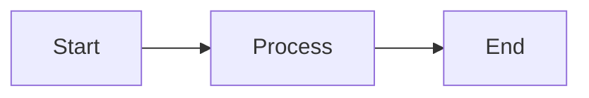

# Markly

**Version 1.0.0** | March 2026

Markly is a free Markdown editor for macOS. It renders your Markdown in real-time and includes powerful writing tools to help you write cleaner, more concise prose.

---

## Getting Started

Markly has three view modes. Set your default in **Preferences > General**:

- **Editor & Preview** — split pane with Markdown on the left, rendered output on the right
- **Editor Only** — full-screen Markdown editing
- **Preview Only** — full-screen rendered output (great for reading)

You can set different defaults for new files vs. existing files, and Markly remembers the view mode you last used for each file.

### Keyboard Shortcuts

| Shortcut | Action |
|---|---|
| Cmd+Shift+K | Command Palette (search all commands) |
| Cmd+Opt+S | Toggle Sidebar |
| Cmd+Opt+F | Focus Mode |
| Cmd+Shift+T | Typewriter Mode |
| Cmd+Opt+E | Export HTML |
| Cmd+Opt+P | Export PDF |
| Cmd+Opt+D | Export DOCX |

---

## Writing Tools

### Focus Mode (Cmd+Opt+F)
Dims all text except the paragraph you're currently writing in. Helps you concentrate on one thought at a time without visual distraction.

### Typewriter Mode (Cmd+Shift+T)
Keeps the line you're typing on vertically centered in the editor window, so your eyes stay in the middle of the screen.

### Weasel Word Highlighting
Toggle via **Command Palette** or **View > Highlight Filler Words**. Highlights weak language in your writing with color-coded categories:

| Color | Category | Examples |
|---|---|---|
| Yellow | Unnecessary qualifiers | actually, basically, very, just, really |
| Orange | Weasel words | should, might, could, significant, many |
| Pink | Indirect/vague language | believe, think, seems, perhaps, things |
| Blue | Weak adverbs | quickly, greatly, tremendously |
| Red | Repeated consecutive words | the the, is is |

Click the issue counter in the bottom-right corner to see a breakdown by category. Updates live as you type.

### Writing Statistics
The word count menu (bottom of the editor) shows:
- Word count, character count
- Estimated reading time
- Readability score (Flesch Reading Ease)

---

## Sidebar (Cmd+Opt+S)

The sidebar has two tabs:

- **Files** — browse Markdown files in the same directory as your document. Double-click to open.
- **Outline** — shows all headings in the current document as a navigable tree. Double-click a heading to jump to it.

---

## Tabs

Markly supports native macOS window tabbing. Open multiple files and use **Window > Merge All Windows** to combine them into tabs.

---

## WikiLinks

Link between Markdown files using double-bracket syntax:

```
[[another note]]
[[another note|display text]]
```

Links to existing files appear in blue. Links to missing files appear in red.

---

## Command Palette (Cmd+Shift+K)

Quickly search and execute any command. Type to filter, use arrow keys to navigate, Enter to execute. Toggle features show a checkmark when active.

---

## Markdown Basics

### Text Formatting

**Bold**: `**Bold**` (Cmd+B)
*Italic*: `*Italic*` (Cmd+I)
~~Strikethrough~~: `~~Strikethrough~~`
==Highlight==: `==Highlight==`

### Headers

```
# Header 1
## Header 2
### Header 3
```

### Links

```
[Link text](https://example.com)
```

### Images

```

```

### Lists

```
- Unordered item
- Another item

1. Ordered item
2. Another item
```

### Code

Inline: `` `code` ``

Block:

````
```python
print("Hello world")
```
````

### Tables

```
| Column 1 | Column 2 |
|----------|----------|
| Cell     | Cell     |
```

### Block Quotes

```
> This is a quote
```

---

## Diagrams

Markly automatically renders Mermaid diagrams and Graphviz graphs in fenced code blocks:

````

````

---

## Math

TeX-like math syntax is supported. Enable **Use dollar sign ($) as inline delimiter** in Preferences > Rendering for inline math:

```
Inline: $E = mc^2$

Block:
$$
\sum_{i=1}^{n} x_i
$$
```

Note: Math rendering requires an internet connection.

---

## Export

Export your documents via **File > Export**:

- **HTML** — standalone HTML file
- **PDF** — print-quality PDF
- **Word Document (DOCX)** — compatible with Microsoft Word

---

## Preview Themes

Choose a preview CSS theme in **Preferences > Rendering > CSS**:

- GitHub2 (default)
- Minimal Light
- Minimal Dark
- iA Writer
- Clearness / Clearness Dark
- Solarized Light / Dark

---

## License

Markly is free. Built on [MacDown](https://github.com/MacDownApp/macdown) by Tzu-ping Chung.
